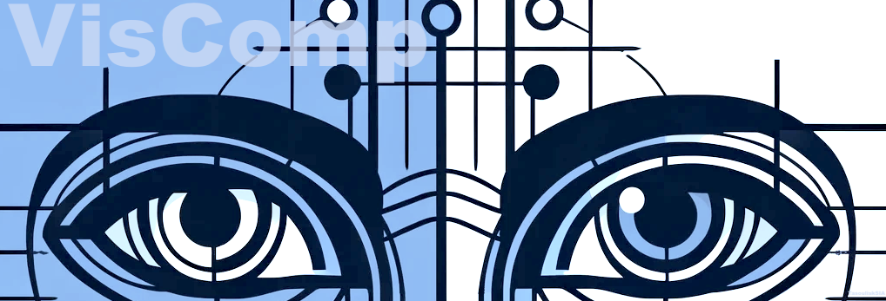

# VisComp 

---
The winning implementation of the 2024 [Makeathon](https://makeathon.uniai.gr/en/home-en/) (AI Hackathon) by UniAI. 

_Challenge issued by Company: [Linakis.digital](https://www.linakis.com/en)_

> Problem: "Compare and review Web page designs and the respective web implementation, in a frictionless manner which provides information regarding mistakes, mismatches and inconsistencies."

---



---

## Description
This project is a tool for comparing design mockups with their implemented websites. It uses OCR (Optical Character Recognition), image similarity comparison, and NLP (Natural Language Processing) to identify and list differences between the design and the implementation.

The project is written in Python and JavaScript, and uses npm and pip as package managers.

## Usage
1. Place the design mockup and the implemented website screenshot in the `Figmas_and_Web_pages/UI_test/public/images` directory. The design mockup should be named `Figma_design.png` and the implemented website screenshot should be named `Web_page.png`.
2. Run the `Main.py` script:
    ```bash
    python Main.py
    ```
3. The script will analyze the images and output a list of differences in the `differences.txt` file in the same directory as the images.

4. Run the `server.js` script to start the server:
    ```bash
    node server.js
    ```
5. Open a web browser and navigate to `http://localhost:{PORT}` to view the differences between the images. (In `{PORT}` enter the port number that the server is running on. In current script the port is set to '**8000**')
---
## Project Structure
The project consists of several Python scripts and a JavaScript file:

- `Main.py`: The main script that orchestrates the comparison process.
- `Image_Similarity.py`: Contains the function for computing the cosine similarity between two images.
- `Claude_3_Sonnet.py`: Contains the function for finding differences between two images using NLP.
- `Object_det.py`: Contains the function for object detection in images.
- `OCR.py`: Contains functions for analyzing images using OCR and comparing the results.
- `server.js`: A simple Node.js server for displaying the differences between the images in a web browser.
---
## Acknowledgements
This project uses the following libraries and APIs:
- AWS SDK for Python (Boto3) for interacting with AWS services
- Pillow for handling images in Python
- OpenAI's GPT-3 for natural language processing provided by Azure services

### Note
Please ensure that you have the necessary permissions and credentials to use the AWS services and OpenAI's GPT-3.

---
### Contributors
_Alphabetically:_
- [Tilemahos Aravanis](https://github.com/TilemahosAravanis)
- [John Chatzis](https://github.com/jcchatzis)
- [Dimitris Damianos](https://github.com/dimitris-damianos)
- [Anastasis Kapetanakis](https://github.com/AnastKap)
- [Anthi Vozinaki](https://github.com/anthiv)

---


## Future Work
- Given the interest in the project, there are plans of further developing. 
- An analytical guide of installation will be provided in the future.
- The project will be updated with more features and functionalities.
- The UI will be further developed and fully funnctional. 
- The project will be updated with more detailed documentation.


- _(More Loadinng...)_

---
#### Disclaimers
_*The project is an original idea and implementation by the winning team members of the [UniAI Makeathon 2024](https://makeathon.uniai.gr/en/home-en/)._

_**The project is not directly affiliated with Linakis.digital or any other company._

_***The README image was AI-generated by [OpenAI's DALL·E](https://openai.com/research/dall-e/)._